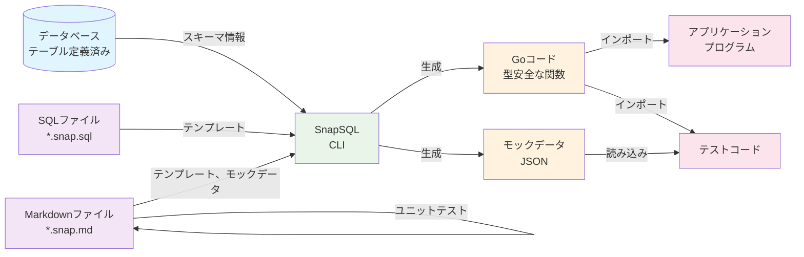

# SnapSQL

SnapSQLは**2-way SQL形式**を使用した動的SQL生成を可能にするSQLテンプレートエンジンです。開発時には標準SQLとして動作し、実行時には動的なクエリ構築の柔軟性を提供するSQLテンプレートを記述できます。

## 哲学

### SQLはパブリックインターフェース
SQLクエリは単なる実装の詳細ではありません。アプリケーションとデータ間のパブリックインターフェースです。SnapSQLはSQLをファーストクラスの市民として扱い、抽象化レイヤーの背後に隠すのではなく、クエリを可視化し、テスト可能で保守可能にします。SQL自体も適切にテストされ、高品質であることが保証されるべきです。

オニオンアーキテクチャやクリーンアーキテクチャでは、データアクセスとUIは同じレイヤーで表現されます。開発者はOpenAPI、GraphQL、gRPCの仕様を通じてUIインターフェースを公開することを好みますが、なぜかデータベースアクセスはリポジトリパターンの背後に隠したがります。SnapSQLは、SQLクエリをデータレイヤーの明示的で文書化されたインターフェースとして扱うことで、この矛盾に挑戦します。SnapSQLはトランザクションを隠さず、リレーショナルデータベースの全パワーを解き放ちます。

### 静的型付けはコミュニケーションツール
型はコンパイラのためだけではありません。開発者、AIエージェント、ツールエコシステムに意図と構造を伝えます。SnapSQLは、SQLスキーマとデータベースメタデータからの高度な型推論を使用してSQLテンプレートから型安全なインターフェースを生成し、クエリとアプリケーションコード間の契約を明示的で自己文書化されたものにします。

if/forディレクティブコメントにより、単一のSQLテンプレートを型安全性を維持しながら異なる用途に柔軟に適応できます。データベースの共通システムカラム（created_at、updated_at、versionなど）は型システム内で自然に処理され、アプリケーションのデータモデルとのシームレスな統合を提供します。

### ランタイムは薄くあるべき
重いORMやクエリビルダーは不要な複雑さとパフォーマンスオーバーヘッドを追加します。SnapSQLのランタイムライブラリは、事前処理されたテンプレートを効率的に実行する軽量なアダプターであり、開発者の生産性を最大化しながらランタイムフットプリントを最小限に抑えます。

小さな依存関係により、プログラムサイズが小さくなり、セキュリティの攻撃対象領域も小さくなります。Goランタイムライブラリは、標準ライブラリに加えて`github.com/google/cel-go`と`github.com/shopspring/decimal`のみに依存し、外部依存関係を最小限に抑えています。

### モッキングはパンドラの箱を開ける
間違ったモッキングはコードを複雑にし、密結合を生み出し、リファクタリングを困難にします。品質のためではなくモックのためのコードを増やします。間違ったモックデータは現実と実装の乖離を加速させ、統合テストまでバグを隠します。

SnapSQLは、本番コードを変更することなく、最も疎結合な場所でモッキングを可能にし、現実と乖離することのない本物のモックデータを提供します。このアプローチは、Mock Service WorkerとPrism Contract Testingからインスピレーションを得ています。

## 動作原理



## 主要機能

- **2-way SQL形式**: コメントを削除すると有効なSQLとして動作するテンプレート
- **動的クエリ構築**: 実行時にWHERE句、ORDER BY、SELECTフィールドを動的に追加
- **セキュリティファースト**: 制御された変更によりSQLインジェクションを防止
- **マルチデータベースサポート**: PostgreSQL、MySQL、SQLite
- **テンプレートエンジン**: 条件ブロック、ループ、変数置換
- **CLIツール**: SQLテンプレートの生成、検証、実行

## クイックスタート

### インストール

```bash
go install github.com/shibukawa/snapsql@latest
```

### プロジェクトの作成

```bash
# 新しいSnapSQLプロジェクトを初期化
snapsql init my-project
cd my-project

# 中間ファイルを生成
snapsql generate

# ドライランでクエリをテスト
snapsql query queries/users.snap.sql --dry-run --params-file params.json
```

### テンプレート例

```sql
-- queries/users.snap.sql
SELECT 
    u.id,
    u.name,
    /*# if include_email */
    u.email,
    /*# end */
    u.created_at,
    u.updated_at,
    /*# if include_profile */
    p.bio,
    p.avatar_url,
    /*# end */
    d.id as departments__id,
    d.name as departments__name,
    d.description as departments__description
FROM users_/*= table_suffix */dev u
    JOIN departments d ON u.department_id = d.id
/*# if include_profile */
    LEFT JOIN profiles p ON u.id = p.user_id
/*# end */
WHERE 1=1
ORDER BY u.created_at DESC
LIMIT /*= pagination.limit */10
OFFSET /*= pagination.offset */0;
```

このテンプレートは、コメントを削除すると有効なSQLとして動作し、実行時の柔軟性を提供します。アンダースコア2つ（`departments__id`、`departments__name`）を持つフィールドは、自動的にネストされたオブジェクトに構造化されます。

### 生成されたコードの使用

```go
// 生成された型安全な関数
func GetUserList(ctx context.Context, db *sql.DB, includeEmail bool, includeProfile bool, tableSuffix string, pagination Pagination) iter.Seq2[User, error] {
    // SnapSQLが上記のテンプレートからこの関数を生成
}

// アプリケーションでの使用
func main() {
    db, _ := sql.Open("postgres", "connection_string")
    
    for user, err := range GetUserList(ctx, db, 
        true,  // includeEmail
        false, // includeProfile
        "prod", // tableSuffix
        Pagination{
            Limit: 50,
            Offset: 0,
        },
    ) {
        if err != nil {
            log.Fatal(err)
        }
        fmt.Printf("User: %s (%s)\n", user.Name, user.Departments[0].Name)
    }
}

// 構造化フィールドを持つ生成された型
type User struct {
    ID          int          `json:"id"`
    Name        string       `json:"name"`
    Email       *string      `json:"email,omitempty"`
    CreatedAt   time.Time    `json:"created_at"`
    UpdatedAt   time.Time    `json:"updated_at"`
    Bio         *string      `json:"bio,omitempty"`
    AvatarURL   *string      `json:"avatar_url,omitempty"`
    Departments []Department `json:"departments"`  // departments__* フィールドから構造化
}

type Department struct {
    ID          int    `json:"id"`
    Name        string `json:"name"`
    Description string `json:"description"`
}

type Pagination struct {
    Limit  int `json:"limit"`
    Offset int `json:"offset"`
}
```

これは基本的な例ですが、SnapSQLは他にも多くの追加機能を提供します：

* **スマートな戻り値型**: クエリを分析して適切な戻り値型を生成 - 複数結果には`iter.Seq2[Res, error]`、単一結果には`Res, error`、戻り値なしには`sql.Result, error`
* **コンテキストベースのシステムデータ**: コンテキストに埋め込まれたシステムデータを自動的にパラメータに展開（JavaのログAPIのMDCメカニズムに類似）
* **ループ構造**: 動的クエリ生成のためのテンプレート内での`for`ループサポート
* **定数データ展開**: 事前定義された定数データでのテンプレート展開
* **複雑な条件式**: CEL（Common Expression Language）を使用した高度な条件ロジック

### Markdownテスト例

SnapSQLはホストプログラミング言語（JavaやPythonなど）なしでユニットテストを実行します。

````markdown
## テストケース

### テスト: 基本的なユーザーリスト

**フィクスチャ（事前テストデータ）:**
```yaml
# usersテーブル
users:
  - {id: 1, name: "John Doe", email: "john@example.com", department_id: 1, active: true, created_at: "2024-01-15T10:30:00Z"}
  - {id: 2, name: "Jane Smith", email: "jane@example.com", department_id: 2, active: true, created_at: "2024-01-14T09:15:00Z"}
  - {id: 3, name: "Bob Wilson", email: "bob@example.com", department_id: 1, active: false, created_at: "2024-01-13T08:20:00Z"}

# departmentsテーブル  
departments:
  - {id: 1, name: "Engineering", description: "Software development team"}
  - {id: 2, name: "Design", description: "UI/UX design team"}
```

**パラメータ:**
```yaml
project_id: 15
include_profile: true
page_size: 3
page: 1
```

**期待される結果:**
```yaml
- {id: 1, name: "John Doe", email: "john@example.com", created_at: "2024-01-15T10:30:00Z", departments__id: 1, departments__name: "Engineering"}
- {id: 2, name: "Jane Smith", email: "jane@example.com", created_at: "2024-01-14T09:15:00Z", departments__id: 2, departments__name: "Design"}
```

### テスト: 空の結果

**フィクスチャ（事前テストデータ）:**
```yaml
# usersテーブル（非アクティブユーザーのみ）
users:
  - {id: 3, name: "Bob Wilson", email: "bob@example.com", department_id: 1, active: false, created_at: "2024-01-13T08:20:00Z"}

# departmentsテーブル  
departments:
  - {id: 1, name: "Engineering", description: "Software development team"}
```

**パラメータ:**
```yaml
active: false
limit: 10
```

**期待される結果:**
```yaml
[]
```
````

このMarkdownファイルは、ドキュメントと実行可能なテストの両方として機能し、データベース依存関係なしでユニットテストのためのモックデータを提供します。

**追加のテスト機能:**

* **dbtestify統合**: 包括的なデータベーステストのための[dbtestify](https://github.com/shibukawa/dbtestify)ライブラリ準拠のテストフレームワーク
* **事前テストデータ設定**: 期待される結果だけでなく、テスト実行前の初期テーブルデータを設定する機能
* **複数データ形式**: YAML、JSON、CSV、dbunit XML形式でのテストデータサポート
* **包括的テストシナリオ**: セットアップ、実行、検証フェーズを持つ複雑なテストケースの定義
* **データベース非依存テスト**: 異なるデータベースエンジン間で同じテストを実行

### モックテスト例

```go
package main

import (
    "context"
    "encoding/json"
    "net/http"
    "net/http/httptest"
    "testing"
    
    "github.com/shibukawa/snapsql/langs/snapsqlgo"
    "github.com/alecthomas/assert/v2"
)

func TestGetUserList_WithMockData(t *testing.T) {
    // "basic_user_list"テストケースからモックデータを含むコンテキストを作成
    ctx := snapsqlgo.WithConfig(context.Background(), "user_list_query", 
        snapsqlgo.WithMockData("basic_user_list"))
    
    // 同じ関数呼び出しだが、データベースにアクセスする代わりにモックデータを返す
    users := make([]User, 0)
    for user, err := range GetUserList(ctx, nil, // モック使用時はdbはnilでも可
        true,  // includeEmail
        false, // includeProfile
        "prod", // tableSuffix
        Pagination{Limit: 10, Offset: 0},
    ) {
        assert.NoError(t, err)
        users = append(users, user)
    }
    
    // モックデータが期待通りであることを検証
    assert.Equal(t, 2, len(users))
    assert.Equal(t, "John Doe", users[0].Name)
    assert.Equal(t, "Engineering", users[0].Departments[0].Name)
    assert.Equal(t, "Jane Smith", users[1].Name)
    assert.Equal(t, "Design", users[1].Departments[0].Name)
}

func TestUserListAPI_WithMockData(t *testing.T) {
    // HTTPサービステスト用のモックデータを含むコンテキストを作成
    ctx := snapsqlgo.WithConfig(context.Background(), "user_list_query", 
        snapsqlgo.WithMockData("basic_user_list"))
    
    // モックコンテキストを含むHTTPリクエストを作成
    req := httptest.NewRequest("GET", "/api/users?include_email=true", nil)
    req = req.WithContext(ctx)
    
    // レスポンスレコーダーを作成
    w := httptest.NewRecorder()
    
    // HTTPハンドラーを呼び出し（内部でGetUserListを呼び出す）
    userListHandler(w, req)
    
    // HTTPレスポンスを検証
    assert.Equal(t, http.StatusOK, w.Code)
    
    var response struct {
        Users []User `json:"users"`
        Count int    `json:"count"`
    }
    err := json.Unmarshal(w.Body.Bytes(), &response)
    assert.NoError(t, err)
    
    // モックデータが使用されたことを検証
    assert.Equal(t, 2, response.Count)
    assert.Equal(t, "John Doe", response.Users[0].Name)
    assert.Equal(t, "Engineering", response.Users[0].Departments[0].Name)
}
```

このアプローチにより、データベース依存関係なしでテストが可能になり、モックデータが本番で使用されるのと同じテンプレートから生成されるため、現実と乖離することがありません。

## ドキュメント

- [テンプレート構文](docs/template-syntax.ja.md) - SnapSQLテンプレート構文の完全ガイド
- [設定](docs/configuration.ja.md) - プロジェクト設定とデータベース設定
- [CLIコマンド](docs/cli-commands.ja.md) - コマンドラインツールリファレンス
- [インストールガイド](docs/installation.ja.md) - 詳細なインストール手順
- [開発ガイド](docs/development.ja.md) - コントリビューションと開発設定

## 現在の状況

🚧 **開発中** - コア機能は実装され動作しています。複数言語のランタイムライブラリが計画されています。

**動作している機能:**
- ✅ SQLテンプレートの解析と検証
- ✅ generate、validate、queryコマンドを持つCLIツール
- ✅ 2-way SQL形式サポート
- ✅ テンプレートテスト用のドライランモード

**計画中の機能:**
- 🔄 ランタイムライブラリ（Go、Python、TypeScript、Java）
- 🔄 型安全なクエリ生成
- 🔄 テスト用モックデータサポート

## ライセンス

- **CLIツール**: AGPL-3.0
- **ランタイムライブラリ**: Apache-2.0（計画中）

## リポジトリ

[https://github.com/shibukawa/snapsql](https://github.com/shibukawa/snapsql)
