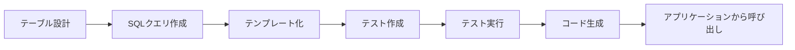

# Getting Started

SnapSQLを使った実践的な開発ワークフローを体験しましょう。

## このチュートリアルの流れ

0. **Overview** - 全体の流れを理解する（このページ）
1. **Installation** - SnapSQLのインストール
2. **Project Setup** - プロジェクトの初期設定とテーブル設計の見本
3. **Write SQL Query** - SQLクエリの作成
4. **SQL Templating** - クエリのテンプレート化
5. **Testing** - テストケースの作成と実行
6. **Code Generation** - Goコードの生成と呼び出し
7. **Application Integration** - アプリケーションへの統合

所要時間: 約30-40分

## 全体の流れ

## 前提条件

- Go 1.24以上
- PostgreSQL、MySQL、またはSQLiteのいずれか
- 基本的なSQLの知識
- Goの基本的な知識

[次へ: 1. Installation →](./installation)

## 関連セクション

* [クエリフォーマット入門](../guides/query-format/index.md)
* [コマンドリファレンス（概要）](../guides/command-reference/index.md)
* [言語別リファレンス](../guides/language-reference/index.md)
* [ユーザーリファレンス（テスト・モック）](../guides/user-reference/index.md)
* [アーキテクチャ概観](../guides/architecture/index.md)
