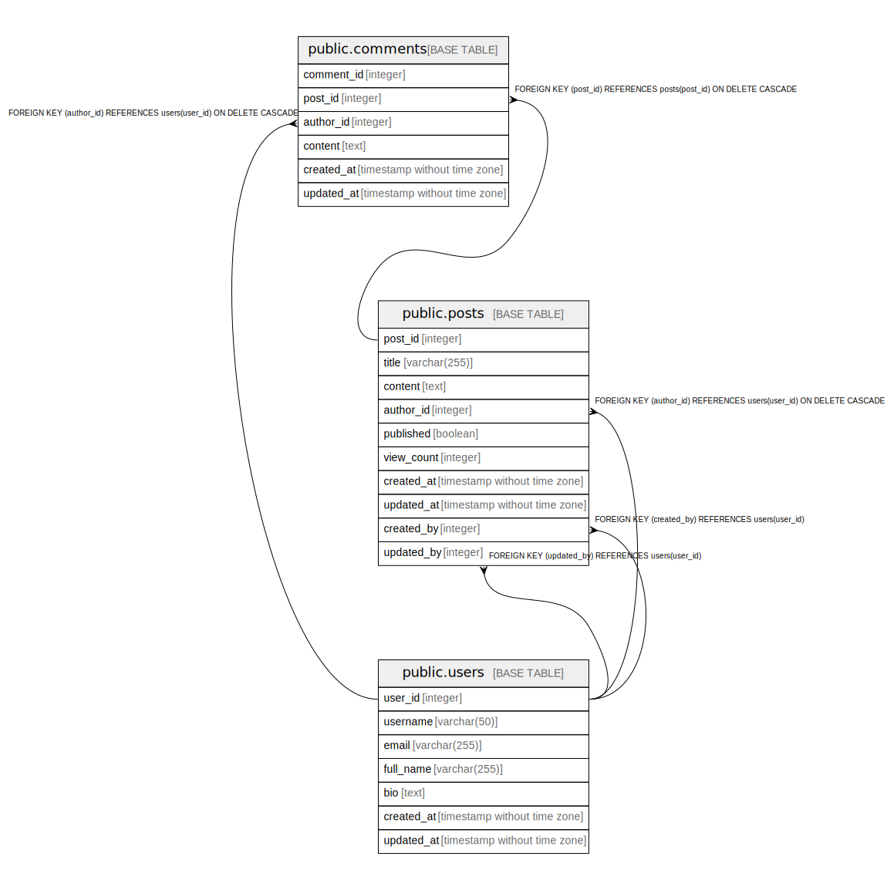

# blogdb

## Tables

| Name | Columns | Comment | Type |
| ---- | ------- | ------- | ---- |
| [public.users](public.users.md) | 7 | User accounts for the blog system | BASE TABLE |
| [public.posts](public.posts.md) | 10 | Blog posts created by users | BASE TABLE |
| [public.comments](public.comments.md) | 6 | Comments on blog posts | BASE TABLE |

## Relations

---

> Generated by [tbls](https://github.com/k1LoW/tbls)
