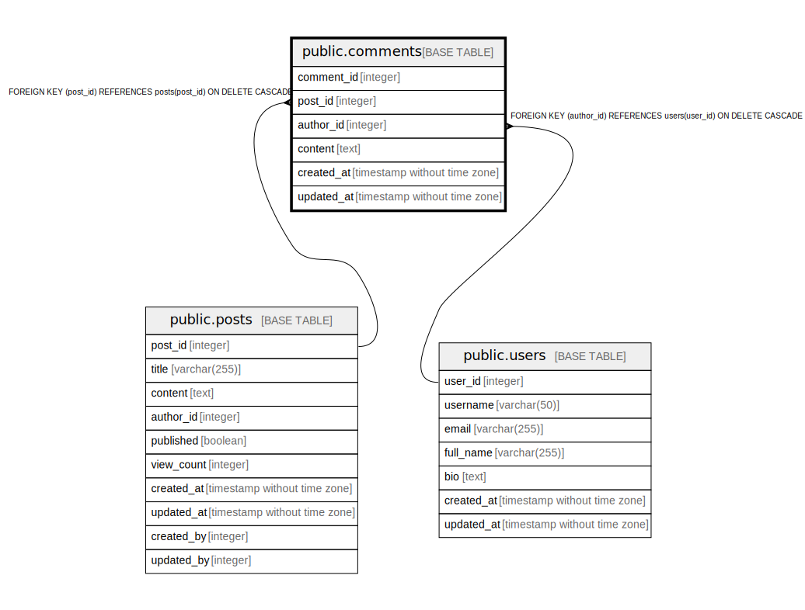

# public.comments

## Description

Comments on blog posts

## Columns

| Name | Type | Default | Nullable | Children | Parents | Comment |
| ---- | ---- | ------- | -------- | -------- | ------- | ------- |
| comment_id | integer | nextval('comments_comment_id_seq'::regclass) | false |  |  | Unique identifier for the comment |
| post_id | integer |  | false |  | [public.posts](public.posts.md) | Foreign key to posts table |
| author_id | integer |  | false |  | [public.users](public.users.md) | Foreign key to users table |
| content | text |  | false |  |  | Comment content |
| created_at | timestamp without time zone | CURRENT_TIMESTAMP | false |  |  | Timestamp when the comment was created |
| updated_at | timestamp without time zone | CURRENT_TIMESTAMP | false |  |  | Timestamp when the comment was last updated |

## Constraints

| Name | Type | Definition |
| ---- | ---- | ---------- |
| comments_author_id_fkey | FOREIGN KEY | FOREIGN KEY (author_id) REFERENCES users(user_id) ON DELETE CASCADE |
| comments_post_id_fkey | FOREIGN KEY | FOREIGN KEY (post_id) REFERENCES posts(post_id) ON DELETE CASCADE |
| comments_pkey | PRIMARY KEY | PRIMARY KEY (comment_id) |

## Indexes

| Name | Definition |
| ---- | ---------- |
| comments_pkey | CREATE UNIQUE INDEX comments_pkey ON public.comments USING btree (comment_id) |
| idx_comments_post_id | CREATE INDEX idx_comments_post_id ON public.comments USING btree (post_id) |
| idx_comments_author_id | CREATE INDEX idx_comments_author_id ON public.comments USING btree (author_id) |

## Relations

---

> Generated by [tbls](https://github.com/k1LoW/tbls)
