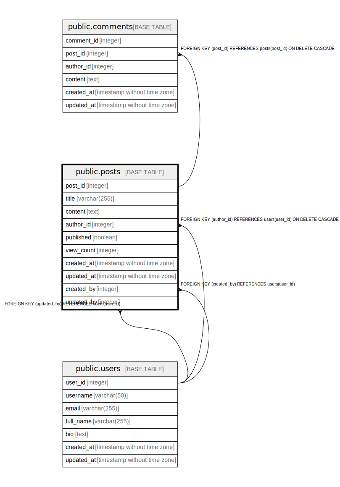

# public.posts

## Description

Blog posts created by users

## Columns

| Name | Type | Default | Nullable | Children | Parents | Comment |
| ---- | ---- | ------- | -------- | -------- | ------- | ------- |
| post_id | integer | nextval('posts_post_id_seq'::regclass) | false | [public.comments](public.comments.md) |  | Unique identifier for the post |
| title | varchar(255) |  | false |  |  | Post title |
| content | text |  | false |  |  | Post content (markdown or plain text) |
| author_id | integer |  | false |  | [public.users](public.users.md) | Foreign key to users table |
| published | boolean | false | false |  |  | Whether the post is published or draft |
| view_count | integer | 0 | false |  |  | Number of times the post has been viewed |
| created_at | timestamp without time zone | CURRENT_TIMESTAMP | false |  |  | Timestamp when the post was created |
| updated_at | timestamp without time zone | CURRENT_TIMESTAMP | false |  |  | Timestamp when the post was last updated |
| created_by | integer |  | true |  | [public.users](public.users.md) | User ID who created the post |
| updated_by | integer |  | true |  | [public.users](public.users.md) | User ID who last updated the post |

## Constraints

| Name | Type | Definition |
| ---- | ---- | ---------- |
| posts_author_id_fkey | FOREIGN KEY | FOREIGN KEY (author_id) REFERENCES users(user_id) ON DELETE CASCADE |
| posts_created_by_fkey | FOREIGN KEY | FOREIGN KEY (created_by) REFERENCES users(user_id) |
| posts_updated_by_fkey | FOREIGN KEY | FOREIGN KEY (updated_by) REFERENCES users(user_id) |
| posts_pkey | PRIMARY KEY | PRIMARY KEY (post_id) |

## Indexes

| Name | Definition |
| ---- | ---------- |
| posts_pkey | CREATE UNIQUE INDEX posts_pkey ON public.posts USING btree (post_id) |
| idx_posts_author_id | CREATE INDEX idx_posts_author_id ON public.posts USING btree (author_id) |
| idx_posts_created_at | CREATE INDEX idx_posts_created_at ON public.posts USING btree (created_at DESC) |

## Relations

---

> Generated by [tbls](https://github.com/k1LoW/tbls)
