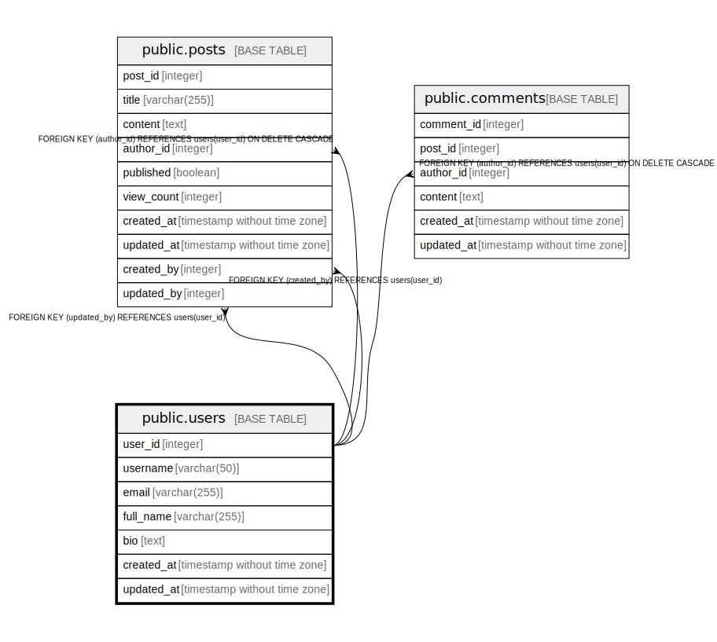

# public.users

## Description

User accounts for the blog system

## Columns

| Name | Type | Default | Nullable | Children | Parents | Comment |
| ---- | ---- | ------- | -------- | -------- | ------- | ------- |
| user_id | integer | nextval('users_user_id_seq'::regclass) | false | [public.posts](public.posts.md) [public.comments](public.comments.md) |  | Unique identifier for the user |
| username | varchar(50) |  | false |  |  | Unique username for login |
| email | varchar(255) |  | false |  |  | User's email address |
| full_name | varchar(255) |  | true |  |  | User's full display name |
| bio | text |  | true |  |  | User's biography or description |
| created_at | timestamp without time zone | CURRENT_TIMESTAMP | false |  |  | Timestamp when the user was created |
| updated_at | timestamp without time zone | CURRENT_TIMESTAMP | false |  |  | Timestamp when the user was last updated |

## Constraints

| Name | Type | Definition |
| ---- | ---- | ---------- |
| users_pkey | PRIMARY KEY | PRIMARY KEY (user_id) |
| users_username_key | UNIQUE | UNIQUE (username) |
| users_email_key | UNIQUE | UNIQUE (email) |

## Indexes

| Name | Definition |
| ---- | ---------- |
| users_pkey | CREATE UNIQUE INDEX users_pkey ON public.users USING btree (user_id) |
| users_username_key | CREATE UNIQUE INDEX users_username_key ON public.users USING btree (username) |
| users_email_key | CREATE UNIQUE INDEX users_email_key ON public.users USING btree (email) |

## Relations

---

> Generated by [tbls](https://github.com/k1LoW/tbls)
